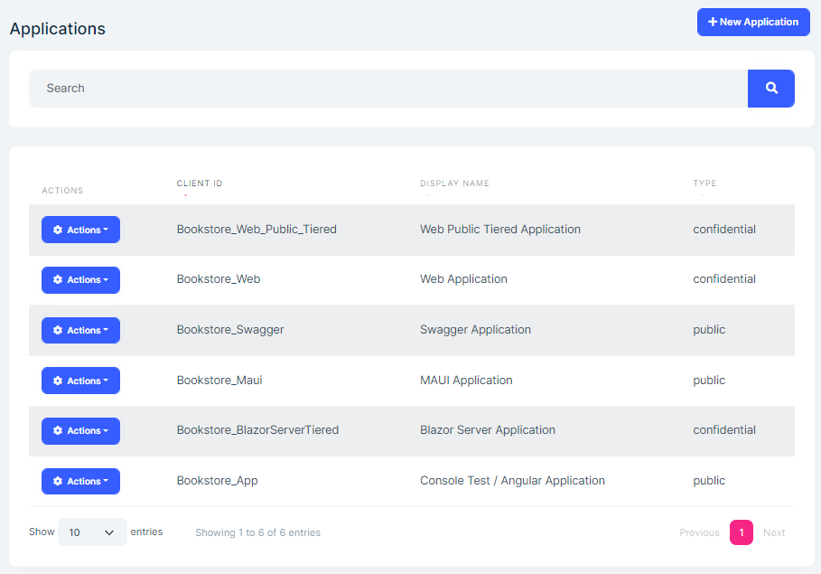
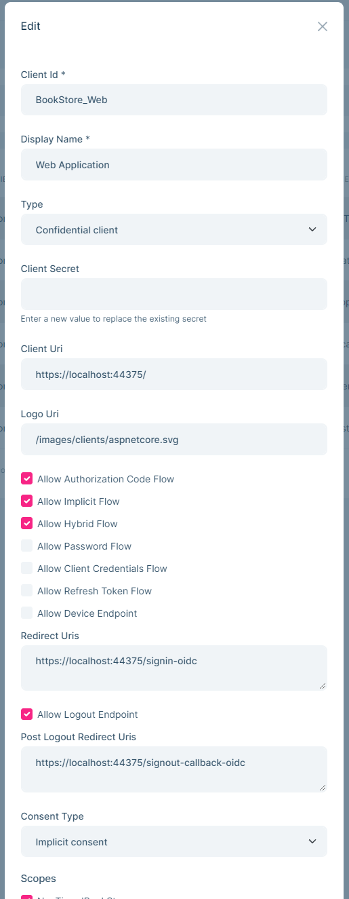
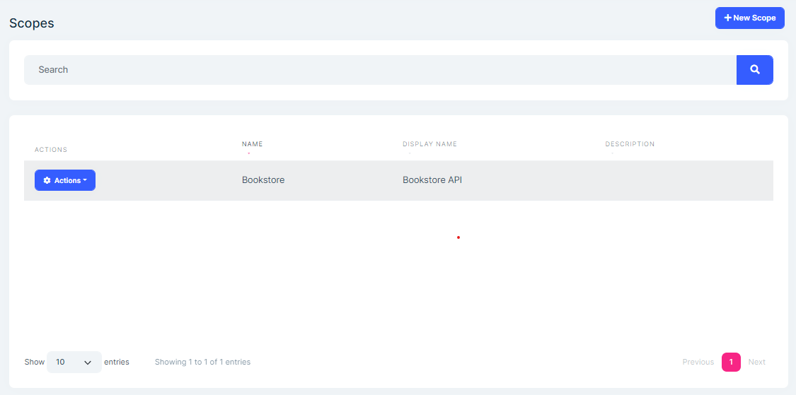
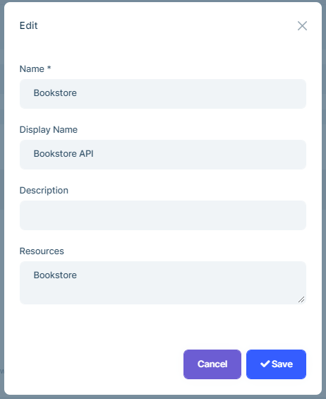
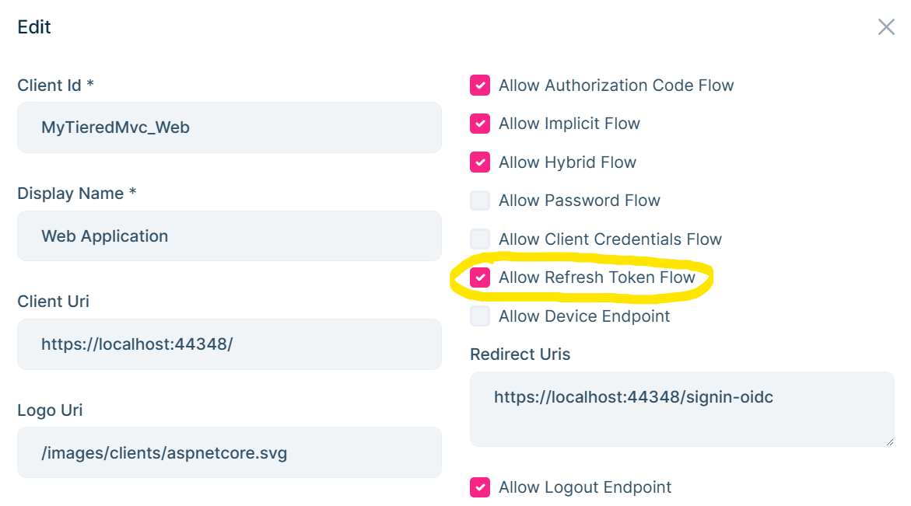

## Administration

### Menu Items

The OpenIddict page allow the following items under the "Administration" menu item:

* **Applications**: Application management page.
* **Scopes**: Scope management page.


### Pages

#### Application Management

Applications page is used to manage applications. An `application` represent hosted applications that can request tokens from Ozdentity.com server.



You can create new application or edit existing applications in this page:



#### API Scope Management

Scope page allows to manage API scope. To allow applications to request access tokens for APIs, you need to define API scopes.



You can create a new API resource or edit an existing API resource in this page:



##### OpenIddictApplication

This section represent the applications that can request tokens from your OpenIddict Server.

- `OpenIddictApplications` (aggregate root): Represents an OpenIddict application.
  - `ClientId` (string): The client identifier associated with the current application.
  - `ClientSecret` (string): The client secret associated with the current application. Maybe hashed or encrypted for security reasons.
  - `ConsentType` (string): The consent type associated with the current application.
  - `DisplayName` (string): The display name associated with the current application.
  - `DisplayNames` (string): The localized display names associated with the current application serialized as a JSON object.
  - `Permissions` (string): The permissions associated with the current application, serialized as a JSON array.
  - `PostLogoutRedirectUris` (string): The logout callback URLs associated with the current application, serialized as a JSON array.
  - `Properties` (string): The additional properties associated with the current application serialized as a JSON object or null.
  - `RedirectUris` (string): The callback URLs associated with the current application, serialized as a JSON array.
  - `Requirements` (string): The requirements associated with the current application
  - `Type` (string): The application type associated with the current application.
  - `ClientUri` (string): URI to further information about client.
  - `LogoUri` (string): URI to client logo.

##### OpenIddictAuthorization

OpenIddictAuthorizations are used to keep the allowed scopes, authorization flow types.

- `OpenIddictAuthorization` (aggregate root): Represents an OpenIddict authorization.

  - `ApplicationId` (Guid?): The application associated with the current authorization.

  - `Properties` (string): The additional properties associated with the current authorization serialized as a JSON object or null.

  - `Scopes` (string): The scopes associated with the current authorization, serialized as a JSON array.

  - `Status` (string): The status of the current authorization.

  - `Subject` (string): The subject associated with the current authorization.

  - `Type` (string): The type of the current authorization.

##### OpenIddictScope

OpenIddictScopes are used to keep the scopes of resources.

- `OpenIddictScope` (aggregate root): Represents an OpenIddict scope.

  - `Description` (string): The public description associated with the current scope.

  - `Descriptions` (string): The localized public descriptions associated with the current scope, serialized as a JSON object.

  - `DisplayName` (string): The display name associated with the current scope.

  - `DisplayNames` (string): The localized display names associated with the current scope serialized as a JSON object.

  - `Name` (string): The unique name associated with the current scope.
  - `Properties` (string): The additional properties associated with the current scope serialized as a JSON object or null.
  - `Resources` (string): The resources associated with the current scope, serialized as a JSON array.

##### OpenIddictToken

OpenIddictTokens are used to persist the application tokens.

- `OpenIddictToken` (aggregate root): Represents an OpenIddict token.

  - `ApplicationId` (Guid?): The application associated with the current token.
  - `AuthorizationId` (Guid?): The application associated with the current token.
  - `CreationDate` (DateTime?): The UTC creation date of the current token.
  - `ExpirationDate` (DateTime?): The UTC expiration date of the current token.
  - `Payload` (string): The payload of the current token, if applicable. Only used for reference tokens and may be encrypted for security reasons.

  - `Properties` (string): The additional properties associated with the current token serialized as a JSON object or null.
  - `RedemptionDate` (DateTime?): The UTC redemption date of the current token.
  - `Status` (string): The status of the current authorization.

  - `ReferenceId` (string): The reference identifier associated with the current token, if applicable. Only used for reference tokens and may be hashed or encrypted for security reasons.

  - `Status` (string): The status of the current token.

  - `Subject` (string): The subject associated with the current token.

  - `Type` (string): The type of the current token.


### Request/Response Process

The `OpenIddict.Server.AspNetCore` adds an authentication scheme(`Name: OpenIddict.Server.AspNetCore, handler: OpenIddictServerAspNetCoreHandler`) and implements the `IAuthenticationRequestHandler` interface.

It will be executed first in `AuthenticationMiddleware` and can short-circuit the current request. Otherwise, `DefaultAuthenticateScheme` will be called and continue to execute the pipeline.

`OpenIddictServerAspNetCoreHandler` will call various built-in handlers (handling requests and responses), And the handler will process according to the context or skip logic that has nothing to do with it.

Example of a token request: 

```
POST /connect/token HTTP/1.1
Content-Type: application/x-www-form-urlencoded

    grant_type=password&
    client_id=App&
    client_secret=1q2w3e*&
    username=admin&
    password=1q2w3E*&
    scope=API offline_access
```

This request will be processed by various handlers. They will confirm the endpoint type of the request, check `HTTP/HTTPS`, verify that the request parameters (`client. scope, etc`) are valid and exist in the database, etc. Various protocol checks. And build a `OpenIddictRequest` object, If there are any errors, the response content may be set and directly short-circuit the current request.

If everything is ok, the request will go to our processing controller(eg `TokenController`), we can get an `OpenIddictRequest` from the HTTP request at this time. The rest will be based on this object.

Check the `username` and `password` in the request. If it is correct create a `ClaimsPrincipal` object and return a `SignInResult`, which uses the `OpenIddict.Validation.AspNetCore` authentication scheme name, will calls `OpenIddictServerAspNetCoreHandler` for processing. 

`OpenIddictServerAspNetCoreHandler` do some checks to generate json and replace the http response content.

The `ForbidResult` `ChallengeResult` are all the above types of processing.

If you need to customize OpenIddict, you need to replace/delete/add new handlers and make it execute in the correct order.

Please refer to:
https://documentation.openiddict.com/guides/index.html#events-model

### PKCE

https://documentation.openiddict.com/configuration/proof-key-for-code-exchange.html

### Setting Tokens Lifetime

Update `PreConfigureServices` method of AuthServerModule (or HttpApiHostModule if you don't have tiered/separate-authserver) file:

```csharp
PreConfigure<OpenIddictServerBuilder>(builder =>
{
    builder.SetAuthorizationCodeLifetime(TimeSpan.FromMinutes(30));
    builder.SetAccessTokenLifetime(TimeSpan.FromMinutes(30));
    builder.SetIdentityTokenLifetime(TimeSpan.FromMinutes(30));
    builder.SetRefreshTokenLifetime(TimeSpan.FromDays(14));
});
```

### Refresh Token

To use refresh token, it must be supported by OpenIddictServer and the `refresh_token` must be requested by the application.

#### Configuring OpenIddictServer

There are two ways to allow an application to use the `refresh_token`.  

* **From OpenIddictDataSeedContributor**, add `OpenIddictConstants.GrantTypes.RefreshToken` to grant types in `CreateApplicationAsync` method:

  ```csharp
  await CreateApplicationAsync(
      ...
      grantTypes: new List<string> //Hybrid flow
      {
          OpenIddictConstants.GrantTypes.AuthorizationCode,
          OpenIddictConstants.GrantTypes.Implicit,
          OpenIddictConstants.GrantTypes.RefreshToken,
      },
      ...
  ```

  > **Note:** You need to re-create this client if you have generated the database already.

* **Or from OpenIddict Management UI**, edit your application and `Allow Refresh Token Flow`:



> **Note:** Angular application is already configured to use `refresh_token`.

#### Configuring Application:

You need to request the **offline_access scope** to be able to receive `refresh_token`. 

In **Razor/MVC, Blazor-Server applications**, add `options.Scope.Add("offline_access");` to **OpenIdConnect** options. These application templates are using cookie authentication by default and has default cookie expire options set as:

```csharp
.AddCookie("Cookies", options =>
{
    options.ExpireTimeSpan = TimeSpan.FromDays(365);
})
```

[Cookie ExpireTimeSpan will ignore access_token expiration](https://learn.microsoft.com/en-us/dotnet/api/Microsoft.AspNetCore.Authentication.Cookies.CookieAuthenticationOptions.ExpireTimeSpan?view=aspnetcore-7.0&viewFallbackFrom=net-7.0) and expired access_token will still be valid if it is set to higher value than the `refresh_token lifetime`. It is recommended to keep **Cookie ExpireTimeSpan** and the **Refresh Token lifetime** same, hence the new token will be persisted in the cookie.

In **Blazor wasm** applications, add `options.ProviderOptions.DefaultScopes.Add("offline_access");` to **AddOidcAuthentication** options.

In **Angular** applications, add `offline_access` to **oAuthConfig**  scopes in *environment.ts* file. (Angular applications already have this configuration).

