# Identity module

This module implements the User and Role system of an application;

* Built on the [Microsoft's ASP.NET Core Identity](https://docs.microsoft.com/en-us/aspnet/core/security/authentication/identity) library.
* Manage **roles** and **users** in the system. A user is allowed to have **multiple roles**.
* Set **permissions** in role and user levels.
* Enable/disable **two factor authentication** and user **lockout** per user.
* Manage basic **user profile** and **password**.
* Manage **claim types** in the system, set claims to roles and users.
* Setting page to manage **password complexity**, user sign-in, account and lockout.
* Supports **LDAP** authentication.
* Provides **email & phone number** verification.
* Supports social login integrations (Twitter, Facebook, GitHub etc...).
* Manage **organization units** in the system.
* View security logs (login, logout, change password...) in the system.

## User interface

### Menu items

Identity module adds the following items to the "Main" menu, under the "Administration" menu item:

* **Roles**: Role management page.
* **Users**: User management page.
* **Claim Types**: Claim type management page.
* **Organization Units**: Organization unit management page.
* **Security Logs**: Security log search page.

`IdentityMenuNames` class has the constants for the menu item names.

### Pages

#### Role management

Roles page is used to manage roles in the system. A role is a set of permissions assigned to the users.

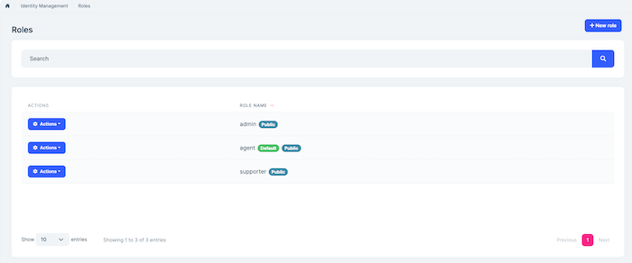

You can create a new role or edit a role in this page:

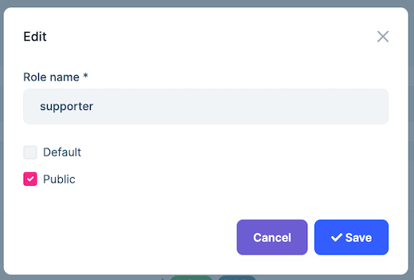

* **Default** roles are assigned to new users by default.
* **Public** roles are visible to other users.

##### Role permissions

You can manage permissions of a role:

* A permission is an **action of the application** granted to roles and users.
* A user with a role will **inherit** all the permissions granted for the role.
* Left side is the **list of modules**. Once you click to a module name, you can check/uncheck permissions related to that module.

##### Role claims

You can set custom claim values for a role:

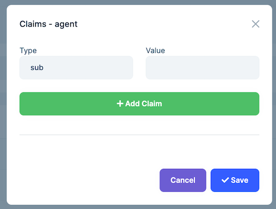

Claim types are retrieved from the claim list defined in the Claim Types  Management page (see below).

#### User management

Users page is used to manage the users in your system.

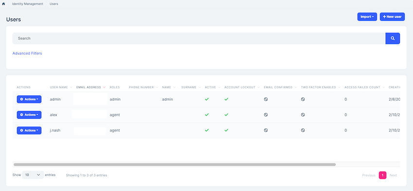

You can create a new user or edit an existing user in this page:

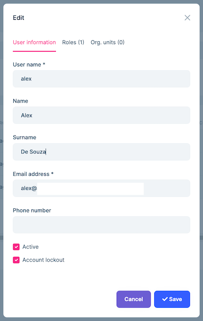

* A user can have **zero or more roles** in the system.
* You can set **two factor** verification and user **lockout** settings per user.

##### User permissions

A user has union of the permissions of the assigned roles. Identity module also allows to grant extra permissions to a specific user.

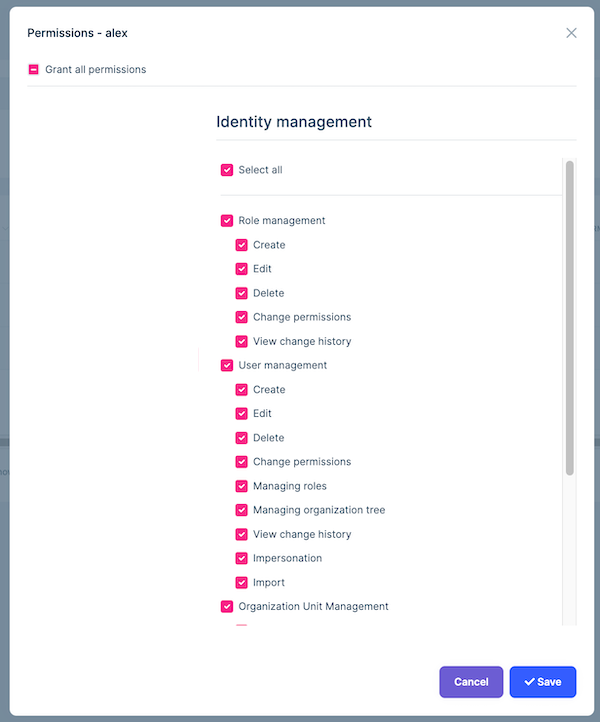

##### User claims

You can also set custom claim values for a user:

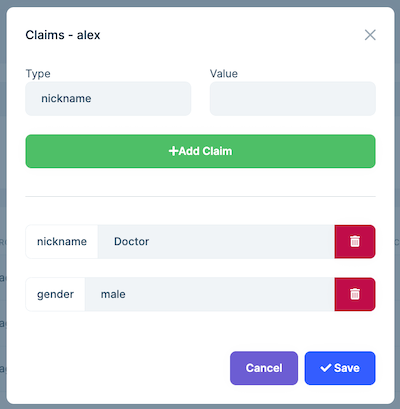

Claim types are retrieved from the claim list defined in the Claim Type Management page (see below).

#### Claim type management

Identity module allows to define custom claim types.

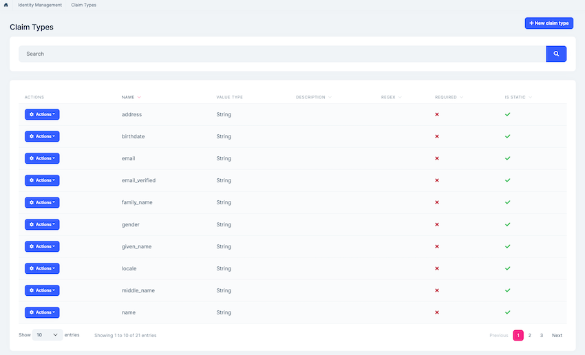

* Custom claims can be used to store additional information to a user or role.
* Custom claim values then can be accessed in the application code for an authenticated user.
* Claim Types are also used by the Identity Server module if you're using it.

#### Identity module settings UI

Identity module adds a new tab to the Settings page to customize the behavior on runtime.

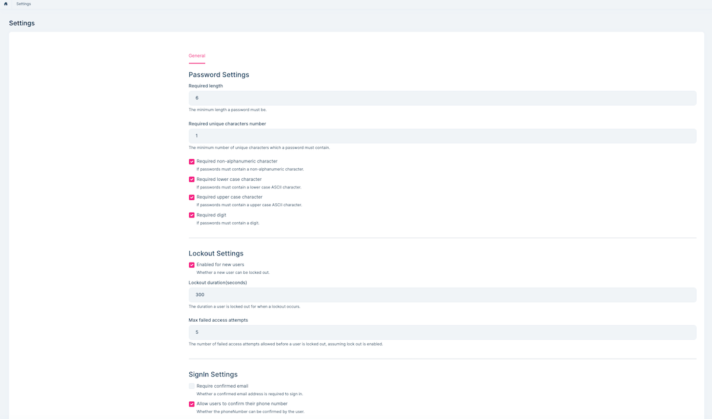

### Organization Units

Organization units page is used to manage organization units, members of organization units and roles of organization units.

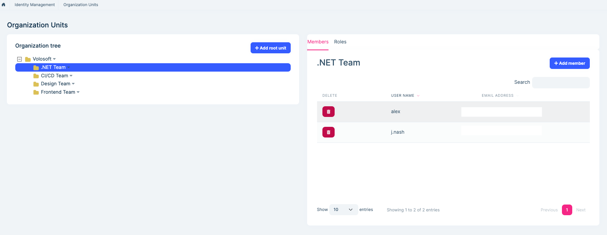

You can add a new organization unit or edit an existing organization unit on this page. In order to add a new root organization unit, click "Add root unit" button and fill the opening form.

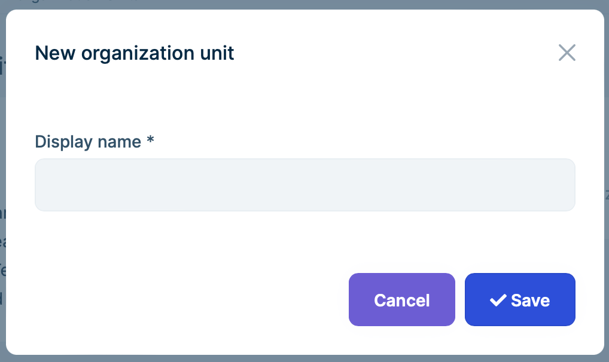

In order to add a sub-unit to an existing organization unit, right click on an existing organization unit and click "Add sub-unit" context menu item. Similarly, in order to edit an organization unit, right click on an existing organization unit and click "Edit" context menu item. 

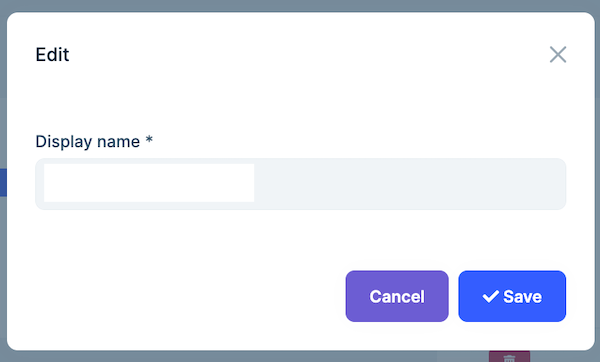

You can manage members of an organization unit using the members tab by selection an organization unit or by right clicking to an item on the organization unit tree.

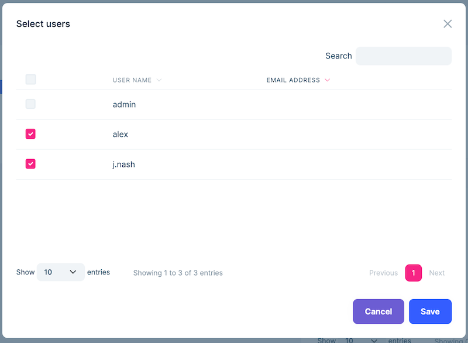	

You can manage roles of an organization unit using the members tab or by right clicking to an item on the organization unit tree. An organization unit inherits permissions of its roles. 

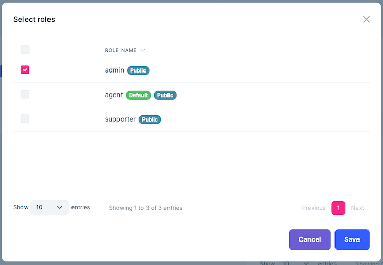

### Security Logs

Security logs page is used to search and view authentication related operations (login, logout, change password...) in the system. 

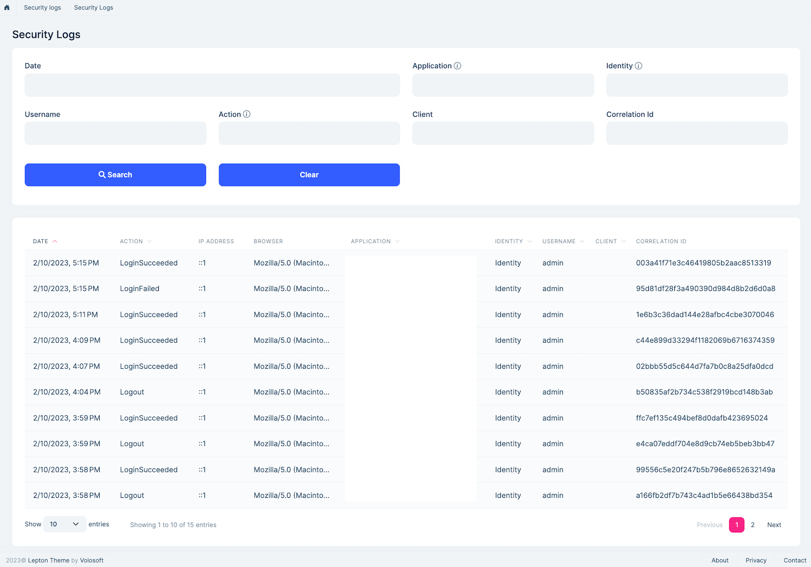	

Also, each user can view security logs for his/her account as shown in the screenshot below;

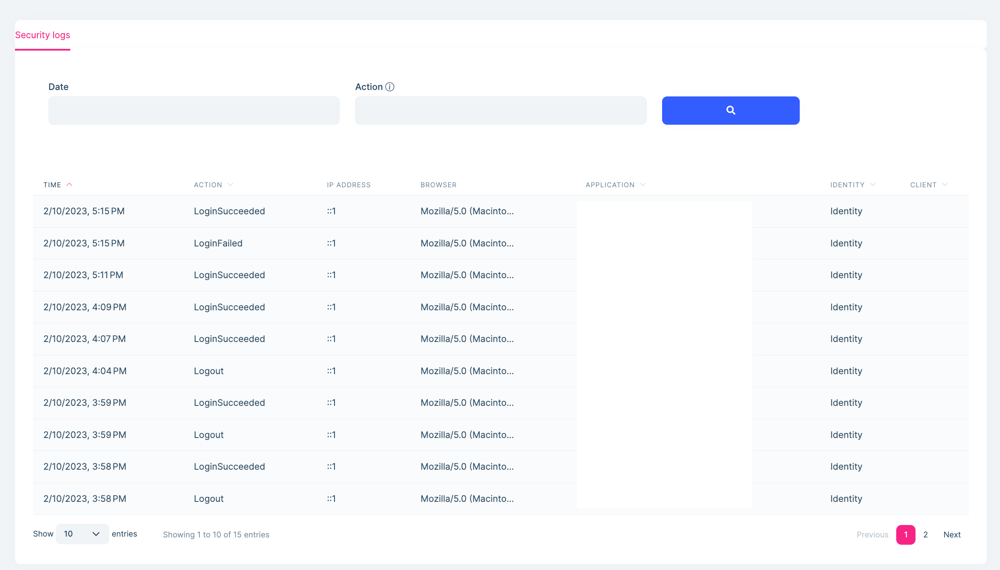	
