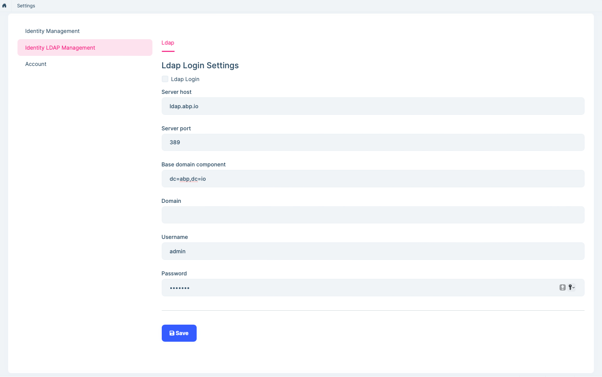

# LDAP External login Provider

## Introduction

Ozdentity has built-in `LdapExternalLoginProvider` and `OpenLdapManager` services. It implements LDAP authentication and gets user info for external login.

The cross platform [LdapForNet](https://www.nuget.org/packages/LdapForNet/) library is used for Windows LDAP authentication. See [LdapForNet GitHub repository](https://github.com/flamencist/ldap4net) for more information.

## How to enable LDAP external login?

Youu need to enable the LDAP login feature and configure related settings.

Then you can enter the LDAP user name and password on the login page for external login.

The default `OpenLdapManager` service uses `$"cn={userName},{BaseDc}"` to normalize user name, and use `$"(&(uid={userName}))"` to search for users, use `mail` as attribute name to get email.

> The value of `BaseDc` is the setting of the `Base domain component`.

If your **username** has a prefix or a specific format, you can override the `NormalizeUserNameAsync` method of `OpenLdapManager` to handle it.