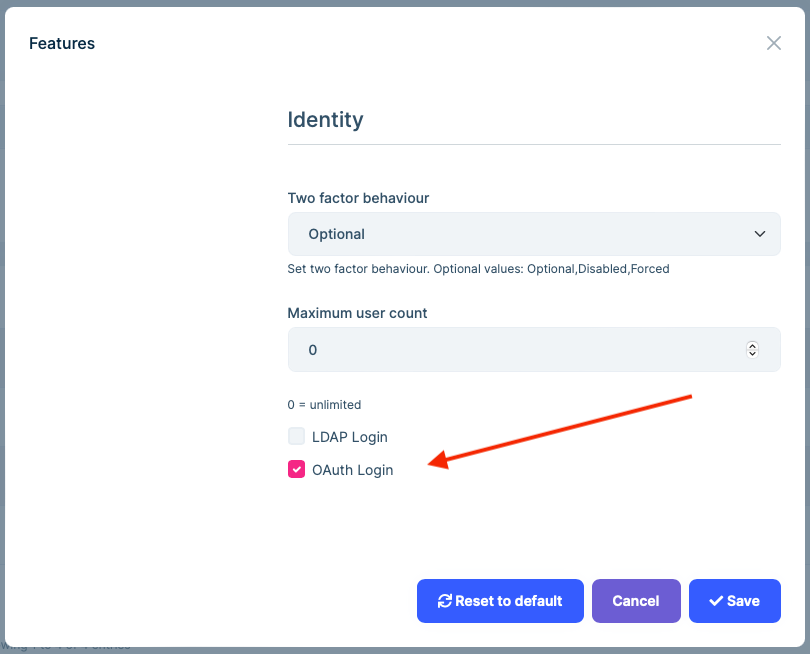
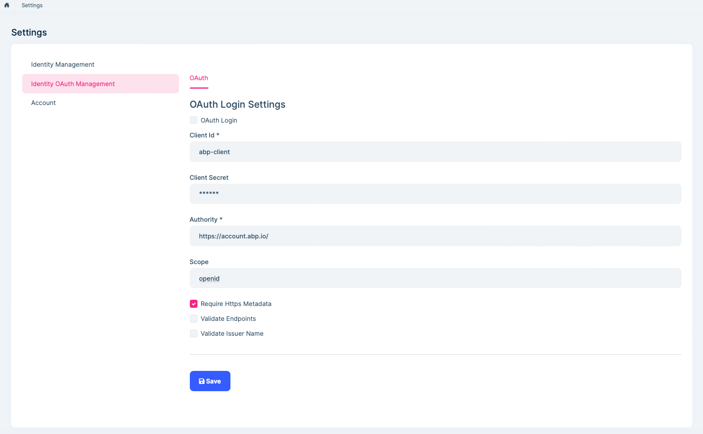
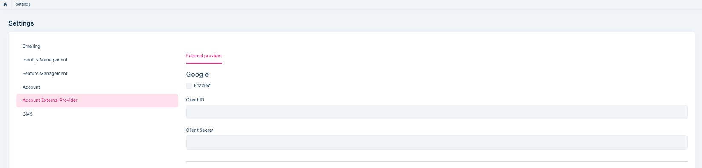

# OAuth Resource Owner Password (ROP) External login Provider

## Introduction

Ozdentity has built-in `OAuthExternalLoginProvider` service. It implements OAuth Resource Owner Password authentication and gets user info for external login.

## How to enable OAuth external login?

You need to enable the OAuth login feature and configure related settings.

Then you can enter the user name and password on the login page for oauth external login.

## Social / External Logins

Account module implements social/external login system. All you need to do is to install & configure the provider you want to use.

The application startup template comes with **Twitter**, **Google** and **Microsoft** logins pre-installed. You can configure the client id and secrets on the Settings page:

Social/External login system is compatible with the multi-tenancy. Each tenant can configure their own provider settings if your application is multi-tenant.
