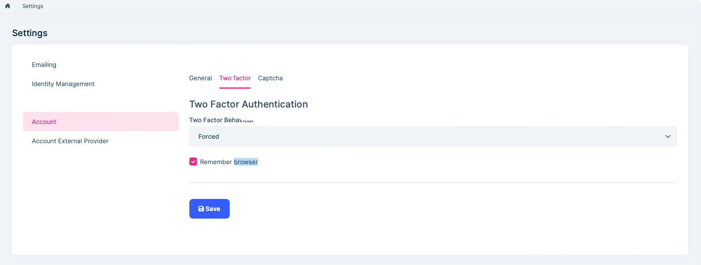
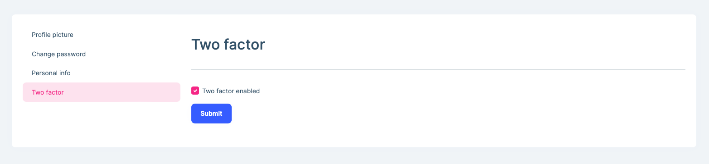
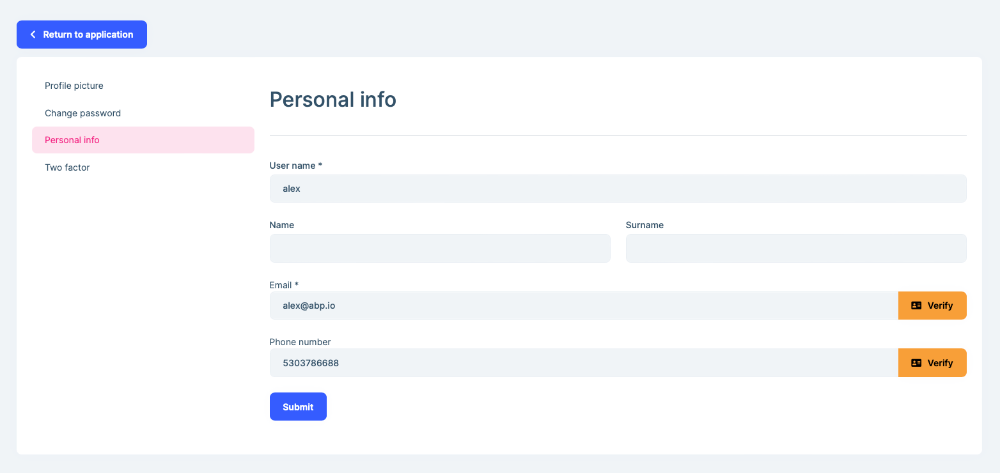
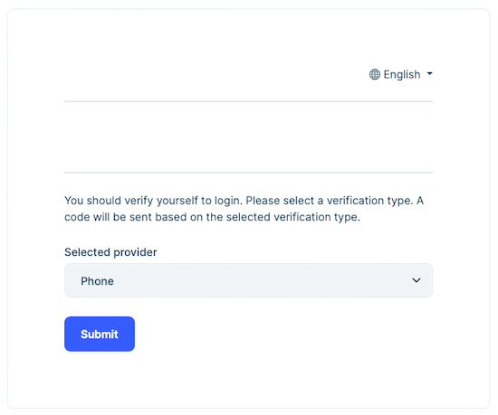

# Two Factor Authentication

Two-factor authentication (**2FA**) is a specific type of multi-factor authentication (MFA) that requires the authenticating party to produce two separate identifying factors to verify your identity. The first factor is something you know "**username & password**" and the second factor is something you have "**mobile device or email**" to verify authentication requests. 2FA protects against phishing, social  engineering and password brute-force attacks and secures your logins  from attackers exploiting weak or stolen credentials.

**This Section** handles **two-factor authentication** at three different layers:

- **Host** admin side
- **User** side

## Two-factor authentication setting

### Host

The User of the host with the required permissions can set two-factor authentication to **force**, **disable**, or **optional** for all users.

- **Forced**: Users must perform two-factor authentication when logging in. End users cannot disable two-factor authentication. Also, all users are forced to login with 2FA.
- **Disabled:** In this case, users will not be able to perform two-factor authentication. Therefore, end users cannot enable two-factor authentication personally.
- **Optional:** In this case, 2FA is at the user's decision. Users can optionally enable 2FA for themselves.

You can change 2FA behavior for all users of the host from the account section **SettingManagement** page:

Here, if we set the two-factor authentication behavior to **force** or **disable**, this feature will be hidden from users wherever the 2FA setting is shown. For example, when this feature is set to be disabled, we can no longer set the 2FA per user on the **Users** page.

When we set the two-factor authentication behavior as **optional**, we see two more options as shown in the below image.

- **Allow users to change their Two Factor:** If this option is not selected, users will not be able to change two-factor authentication behavior for their accounts. But the user of the host with the necessary permissions can change two-factor authentication behavior per user. 

- **Remember browser:**  When selected, users are provided with the option of "**Remember this browser**" check box during verification. Once a user logins with the 2FA on a browser/device, website will not ask for a verification code for that browser for a specific period of time, hence only username & password credentials will be required to login.

### User side

If the 2FA is set as **optional** by the admin user of the host, all users of the host can change the 2FA behavior of their account from the Manage page. There is another setting that affects this behavior:  **Two factor enabled** option. This option must be checked to let users change their 2FA setting. Otherwise, users will not be able to change 2FA setting.

## Verification providers

There are 2 verification providers available for 2FA out of the box:

- **Email Verification:** This is available if the user has a verified email address. **Be aware that if the user has no verified email address then no verification email will be sent!** This setting is stored on `EmailConfirmed` field of the user entity.

- **SMS Verification (Comming Soon....):** This available if the user has a confirmed phone number. This setting is stored on `PhoneNumberConfirmed` field of the user entity. You need to add a SMS vendor to be able to send SMS. If you purchase a subscription from [Twilio](https://www.twilio.com/) and add the Twilio SMS configuration you will be able to send SMS verification code.

### Why don't users receive a verification code even 2FA enabled?

Although the 2FA setting is enabled, users may not be able to use 2FA. This is because the user does not have a **verified e-mail or phone number**. The verification code cannot be sent to an unverified address for security measures. Ensure that **Verified** label next to email or phone number to ensure that corresponding user can receive verification code.

## 2FA From the End Users' Perspective

A user whose two-factor authentication setting is **enabled** and email/phone number is verified can receive verification code. After entering the correct username and password combination, the user will be prompted to choose an authentication provider from a dropdown list:

> If both the e-mail and phone number of the user are verified, it will appear in two options as **verification provider** on this screen. If the 2FA setting is enabled, but there is no verified **e-mail address** or **phone number**, the user will directly login without the 2FA check.

Then a **verification code** is sent to via the selected provider and the user enters the code on the below page:

**Remember this browser** option will only be shown if it's enabled by admin. Clicking on the **Remember this browser** check box will exempt you from needing to use 2FA to log on when using the same device and browser. Enabling 2FA and clicking on **Remember this browser** will provide you with strong 2FA protection from malicious users trying to access your account, as long as they don't have access to your device. You can do this on any private device you regularly use. By setting **Remember this browser**, you get the added security of 2FA from devices you don't regularly use, and you get the convenience on not having to go through 2FA on your own devices. After users enter the correct security code, they will be able to successfully log into the application. 